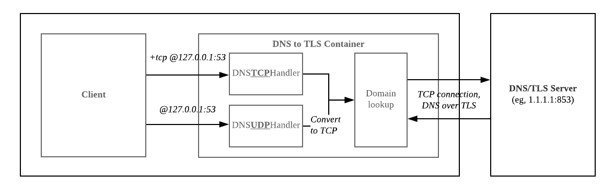

# KC's DNS over TLS deployment proejct
Python application which fowards DNS queries via DNS over TLS.

## Summary
- Bind TCP and UDP socket session for forwarding to DoT(DNS over TLS) connection.
- Lookup domain to DNS/TLS server with DoT connection.  
- Dockerized the DoT application on Alpine Linux (Dockerfile).

## Service Architecture


## Implementation
**1**. Security concerns
  - When the host is compromised, the service containers are also exposed to danger.
  - For detecting maleficent traffic, the engineer needs to gather every single DoT container logs. In this case, we need to have a centralized log monitoring solution such as ElasticSearch.

**2**. Method of traffic measurement
  - Using TCPDUMP or Wireshark to capture in/out encrypted traffic with DNS/TLS port.
  - Capturing the Docker bridge(docker0) network which is the way to send/receive host internal DNS query requests.
  - Comparing the Docker bridge and external network interface traffic which is encrypted.

**3**. Future improvements
  - Serve with internal DNS. Depend on domain query; the app has to check and forward the query to internal or external.
  - DNS Caching for making high performance. [Unbound DNS](https://www.unbound.net/) caching is one of the options for this.
  - High Availability design for resilience. Current DoT service is SPOF. Also, the service may need to use a caching backend system for sharing DNS zone state.
  - Configure K8S deployments and liveness prob values to provide robust service.

## Installation
**1**. Setup application
  - Configure Enviroment.(If you use default docker image [kcfigaro/dot:latest](https://hub.docker.com/r/kcfigaro/dot/), you don't need to configure ENV values)
  
  ```
  DOT_PORT=53
  DNS_SERVER_IP='1.1.1.1'
  DNS_SERVER_PORT=853
  ```
  
  - Deploy app using docker image. [DockerHub](https://hub.docker.com/r/kcfigaro/dot/)
  
  ```
  # default
  $ docker run -d -p 53:53 -p 53:53/udp kcfigaro/dot:latest
  
  # custom config(In case of using another DOT_PORT or DNS/TLS server and port)
  $ docker run -d -p 9953:9953 -p 9953:9953/udp -e DOT_PORT=9953 -e DNS_SERVER_IP='9.9.9.9' -e DNS_SERVER_PORT=853 kcfigaro/dot:latest
  ```
  
  - Deploy app on host.
  
  ```
  $ sudo mkdir /app
  $ sudo git clone https://github.com/cloudacode/DoT.git /app
  $ sudo python /app/dns_over_tls.py
  ```

**2**. Verify application
  - Check DNS over TLS query.
  
  ```
  # TCP request via dig 
  $ dig +tcp -p <DOT_PORT> @127.0.0.1 example.com
  
  # UDP request via dig 
  $ dig -p <DOT_PORT> @127.0.0.1 example.com
  ```
  
  - Check encrypted traffic while DNS queries(above scripts) are running.
  
  ```
  $ sudo tcpdump -n port 853 -i eth0 -X
  ```

## DEMO
  how to provision and verify the service with the dot container
  
  [](https://www.youtube.com/watch?v=o2pQQil8EME)
  

## Resource
  Essentials:
  - [Socket](https://docs.python.org/2/library/socketserver.html)
  - [SSL](https://docs.python.org/2/library/ssl.html)
  - [DNS](https://tools.ietf.org/html/rfc1035)  
